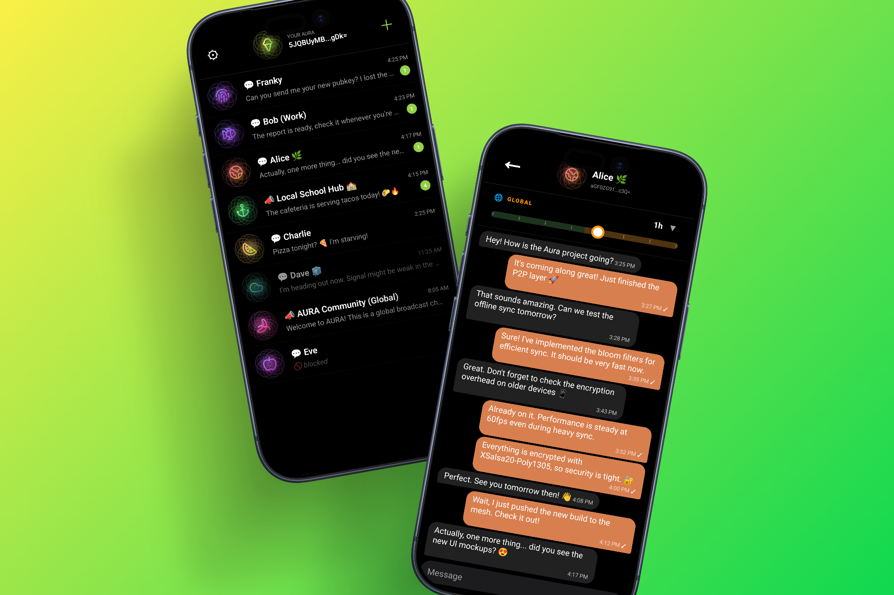
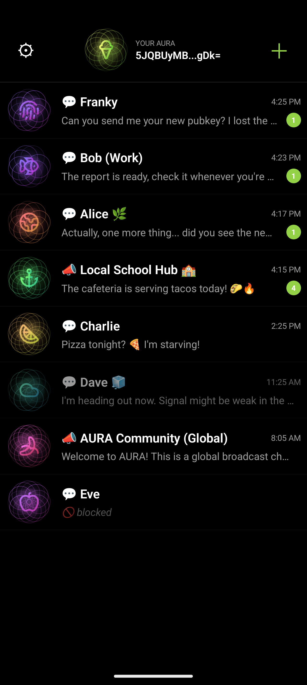
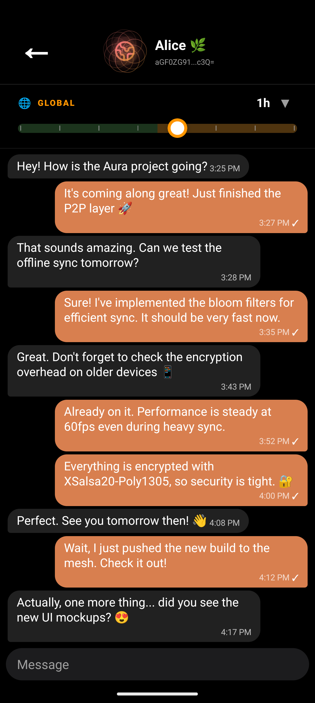
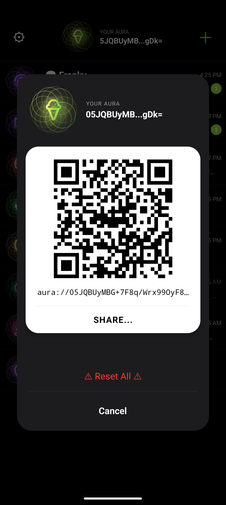

  

> **Decentralized. Peer-to-Peer. Offline.**
> Free communication without borders, servers, or surveillance.

**AURA** is a decentralized messenger leveraging **Nearby Connections** technology to create robust mesh networks. It thrives where the internet fails, bypassing censorship and eliminating central points of failure.

  

---

## 📸 Screenshots

   
   
   

---

## ✨ Key Features

* **🌐 Offline Mesh:** Powered by Bluetooth and Wi-Fi Direct. Messages hop from device to device seamlessly.
* **🎭 The Aura:** A unique digital identity concept. Your specific color, icon, and behavior patterns form your "Aura" within the network.
* **🔐 Total Privacy:** End-to-End (E2E) encryption for all data.
    * Complete anonymity: messages are injected into a shared distributed ledger without sender or recipient metadata.
* **🛡 Flood Protection:** Smart architecture designed to mitigate "Blackhole" and flood-based attacks.
* **🎨 Modern UI/UX:** A smooth, intuitive interface that bridges the gap between high security and everyday usability.

---

## 🛠 Tech Stack

### 📱 Frontend (Mobile)

* **Framework:** [React Native 0.83.1](https://reactnative.dev/)
* **State Management:** [Jotai](https://jotai.org/) + `jotai-family`
* **Navigation:** React Navigation 7

### ⚙️ Native Layer (Android)

* **Language:** Kotlin + Coroutines
* **Networking:** [Google Nearby Connections](https://developers.google.com/nearby/connections/overview) (The core of local P2P mesh)
* **Geolocation:** Play Services Location (For proximity-based node discovery)

### 🔐 Security & Cryptography

* **Engine:** [Bouncy Castle](https://www.bouncycastle.org/) (Industrial-grade crypto provider)
* **PoW:** Argon2 (via Signal implementation).
* **Storage:** [op-sqlite](https://github.com/OP-Engineering/op-sqlite)

### 📸 Utilities

* **Camera:** Vision Camera 4 (For scanning contact QR codes)
* **QR Generation:** React Native QR Code SVG.
---

## 🏗 How It Works (Architecture)

AURA avoids Tor to ensure faster and more stable connections within local networks. Instead, it utilizes a **Distributed Message Ledger** system.

1.  **Diffusion:** A message is encrypted and broadcast to all available peers.
2.  **Relay:** Nodes retransmit the message further into the mesh.
3.  **Discovery:** Only the private key holder can decrypt and read the intended message.
4.  **Zero-Knowledge:** No node in the relay chain knows the identity of the final recipient.

## ⛓️ Dual-Layer Ledger System

AURA utilizes a unique Dual Ledger system to balance local speed with global reach:

1. **Local Ledger (L1):**
    - Operates purely via P2P connections (Bluetooth/Wi-Fi).
    - Messages circulate exclusively among physically proximate devices.
    - Perfect for "off-the-grid" scenarios or maximum immediate privacy.

2. **Global Ledger (L2):** *(In Development)*
    - Messages can reach Global Nodes (Gateways) if any peer in the mesh gains internet access.
    - Enables worldwide communication while maintaining anonymity through ledger mixing.

> [!TIP]
> **Deep dive into the protocol:** Read the full technical specification in [AURANET.md](AURANET.md)

---

## 🚀 Roadmap

- [x] UI Prototype and **Aura** concept
- [x] Local Distributed Ledger (L1) implementation
- [ ] Global Ledger (L2) and first Gateway nodes
- [ ] Fast nearby direct messaging and files exchange
- [ ] iOS Support (Multiplatform)

---

## 🤝 Contributing

This project is currently in the **Alpha** stage. Contributions are more than welcome:
1. Fork the repository.
2. Create your `feat/your-feature` branch.
3. Commit your changes using [Gitmoji](https://gitmoji.dev/).
4. Open a Pull Request.

---

## 📄 License

Distributed under the GNU GPL V3 License. See [LICENSE](LICENSE) for more information.

---

  Made with ❤️ for a free world and digital sovereignty.

